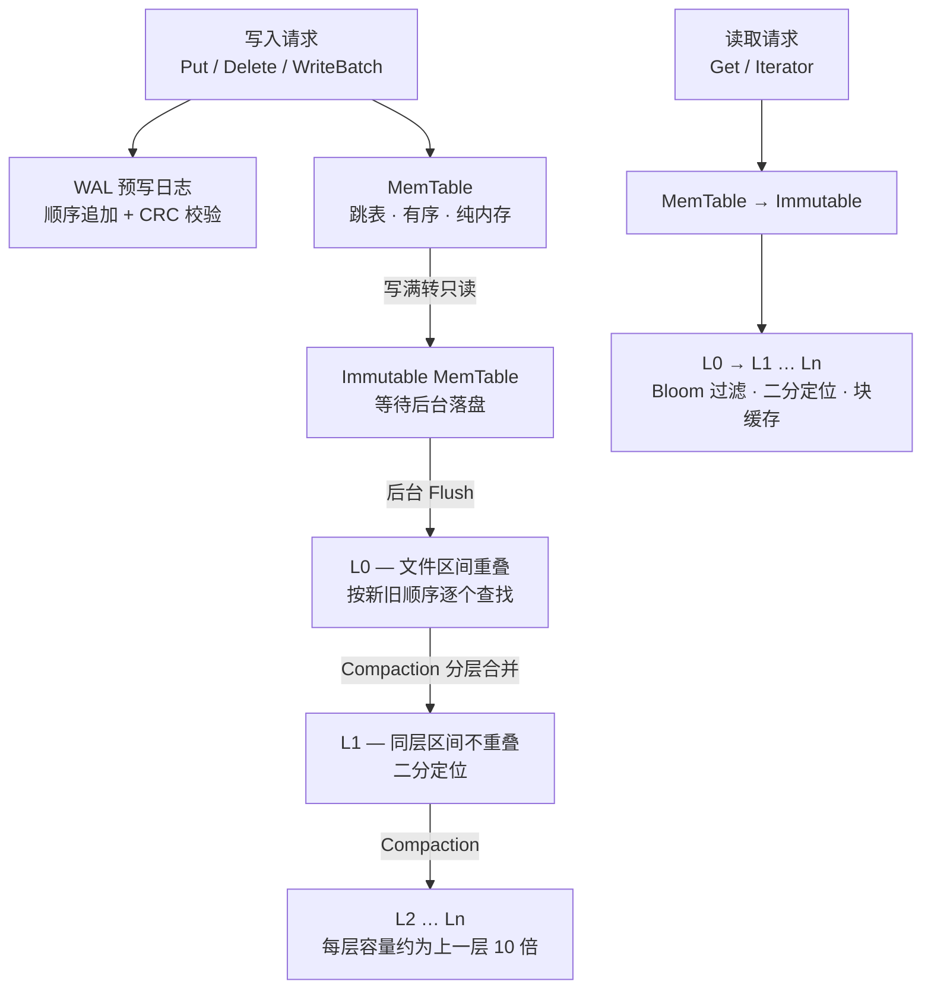

# kvdb

> 用 Go 写的单机嵌入式 KV 存储引擎，架构取自 RocksDB / LevelDB 的 LSM-Tree，但只保留内核思想。
> 约 1.1 万行实现代码 + 9 千行测试，13 个内部包，除 `snappy` 外没有外部依赖。

```go
db, err := kvdb.Open(kvdb.DefaultOptions("data"))
if err != nil {
    return err
}
defer db.Close()

if err := db.Put([]byte("k"), []byte("v")); err != nil {
    return err
}
v, err := db.Get([]byte("k")) // key 不存在或已删除时返回 ErrNotFound
```

---

## 它能做什么

| 能力 | 说明 |
|---|---|
| **有序 KV** | 点查、前向范围扫描、原子批量写、快照读 |
| **WAL** | 32KB 分块顺序追加，每块 CRC32C 校验，崩溃后重放，尾部损坏可容忍 |
| **MemTable** | 跳表实现，读无锁、写串行；写满冻结为 Immutable，后台 Flush 成 SST |
| **SSTable** | Data / Filter / Index / MetaIndex / Footer 五段式；块内前缀压缩 + 重启点，块尾带 CRC |
| **分层与 Compaction** | L0 按文件数触发、L1 以下按容量触发；Manifest + CURRENT 记录版本，靠引用计数存活 |
| **读优化** | 每个 SST 一个 Bloom 位图 + 分片 LRU 块缓存（缓存解压后的块） |
| **块压缩** | Snappy / zlib，**按块独立判断**，压不划算的块原样存储 |
| **组提交** | 并发写者合并成一次 WAL 追加 + 一次 fsync，实测合并率 22~28 |
| **限流** | 后台 Compaction 的读写带宽受令牌桶约束，等待只发生在后台线程内部 |
| **崩溃恢复** | 强杀进程不会让数据目录打不开；可容忍的损坏通过 `RecoveryReport` 如实汇报 |
| **Checkpoint** | 在另一个目录生成可独立打开的一致性副本，源库无需停止世界 |
| **目录锁** | 由内核持有（Windows `LockFileEx` / Unix `flock`），进程消亡即释放 |

## 不做的事（划死的边界）

分布式 / Raft、事务隔离级别、二级索引、加密鉴权、多进程并发访问同一目录、兼容 RocksDB 的 API 或磁盘格式。

这不是偷懒，是范围控制：RocksDB 本体是 40 万行 C++ 和上百个可调参数，本项目的目标是把 LSM-Tree 的内核讲清楚、跑起来，而不是功能对齐。

---

## 快速开始

```bash
go test ./...                                   # 全量测试
go test -race ./...                             # 竞态检测（需 cgo）
go run ./cmd/kvdb-bench -mode ycsb -workload A  # 跑一份 YCSB 压测
```

```go
package main

import (
    "fmt"

    "kvdb"
)

func main() {
    opts := kvdb.DefaultOptions("data")
    opts.SyncWrites = true // 默认即为 true：Write 返回即代表已 fsync 落盘

    db, err := kvdb.Open(opts)
    if err != nil {
        panic(err)
    }
    defer db.Close()

    // 原子批量写
    b := kvdb.NewWriteBatch()
    _ = b.Put([]byte("a"), []byte("1"))
    _ = b.Delete([]byte("b"))
    if err := db.Write(b); err != nil {
        panic(err)
    }

    // 快照读：只记下一个序列号，不复制数据、不阻塞写入
    snap := db.GetSnapshot()
    defer snap.Release()
    v, _ := snap.Get([]byte("a"))
    fmt.Println(string(v))

    // 范围扫描（闭区间）
    it := db.NewIterator(&kvdb.IteratorOptions{
        LowerBound: []byte("a"),
        UpperBound: []byte("z"),
    })
    defer it.Close()
    for it.SeekToFirst(); it.Valid(); it.Next() {
        fmt.Println(string(it.Key()), string(it.Value()))
    }

    // 可观测性：读放大 = ReadProbes/Gets，合并率 = WriteBatches/WriteGroups
    st := db.Stats()
    fmt.Println(st.Levels, st.WriteBatches/st.WriteGroups, st.Compression.RawBytes)
}
```

> **模块路径提示**：`go.mod` 里的模块名是 `kvdb`（本地项目名）。放到 GitHub 上供他人引用前，
> 建议执行 `go mod edit -module github.com/<你的账号>/kvdb`，或在引用方用 `replace` 指令指过去。

---

## 架构



写路径的成本几乎全在一次 fsync 上，读路径的成本在层数和无效 IO 上。这两句话决定了整个引擎的形状：

- **写**只追加，永不原地更新 ⇒ 顺序 IO，天花板 = 每秒 fsync 次数 ⇒ 所以需要**组提交**。
- **读**最坏要穿透每层 ⇒ 需要 Bloom Filter 挡掉无效 IO、需要 Compaction 把 L0 的重叠区间收敛成有序不重叠布局。

---

## 值得一提的几个设计

这些是本项目相对"教科书版 LSM-Tree"真正下过功夫的地方，也是代码里注释最密的部分。

### 1. 组提交：fsync 在锁外，队长排空队列才让位

并发写者先排进一条**独立锁 `wmu`** 保护的写队列（不复用保护全局状态的 `db.mu`），队首的写者（队长）把当前队列里的所有批次合并成**一次 WAL 追加 + 一次 fsync**，再整组一起落进 MemTable。

- 最贵的 fsync 完全在 `db.mu` 之外完成 —— **读者的延迟不会被写者的磁盘等待拖住**。
- 队长必须"排空队列才让位"，不能"提交一组就让位"：后者会丢失唤醒，让位瞬间刚排进来的写者永远等不到 `done`。
- 三步顺序固定：`beginWriteGroup`（分配序列号，不动 `db.lastSeq`）→ `appendWriteGroup`（追加 + fsync，锁外）→ `applyWriteGroup`（整组在一个临界区里落库，最后才推进 `lastSeq`）。于是**不存在"半组可见"**。
- 失败语义是 RocksDB 式的：一条**批次**是原子的，一个**提交组**不是。组内任何一步出错就整组失败并停库 —— "报错但写成功了"是比崩溃更难查的一致性缺口。

实测 32 个并发写者下合并率 22~28，即同样次数的 fsync 服务了二十多倍写入。

### 2. 压缩按块独立判断，而不是全文件一刀切

一个 Data Block 写满时才压缩，压完若省不下 1/8 就**原样存储**。于是过滤器位图、小索引块、高熵数据这类"压了白压"的块自动跳过。块缓存存**解压后**内容，解压开销被命中率摊薄。

200k × 200B 文本负载实测：Snappy 把 SST 从 41.74MB 压到 6.10MB（6.87×），zlib 压到 3.62MB（11.66×），而**写入耗时几乎无差**（压缩 CPU 被后台 Flush/Compaction 吸收，没有侵入前台写路径）。

### 3. 限流换的是长尾，不是吞吐

给后台 Compaction 一个字节/秒配额后，它自觉地从"做完 7 轮"退到"只做 1 轮"，前台吞吐只降约 13%。等待只发生在 Compaction 线程内部，前台读写完全不受阻塞 —— 用后台的"慢"，换前台读延迟的稳定。

### 4. 快照与迭代器是两套机制，不合并

- **快照**靠**登记**：抬高 `smallestSnapshot`，拦住 Compaction 丢弃它还需要读的旧版本。
- **迭代器**靠**版本引用**：持有构造那一刻的 `Version`，让它在读的那批文件不会被删掉。

如果把两者合并（给迭代器也登记快照），丢弃上界会被永久钉死，旧版本再也回收不掉。代价是 `Iterator.Close()` 变成必需调用 —— 不 Close 等于一直拦着那次 Compaction 的输出文件被回收。

### 5. 崩溃恢复对"坏文件"分类而不是一律删除

- `DiscardedFiles`：footer 不全、块校验失败的**残片**，根本不该存在；
- `ObsoleteFiles`：文件本身完整，但 Manifest 里那次提交还没落盘就崩了 —— **曾经想提交但没提交成功**。

判据是"能否正常打开"。两者都安全删除（数据还在 WAL 或旧版本里），但用户有权知道发生了什么，所以 `db.RecoveryReport()` 会把它们如实列出来。

### 6. 目录锁用内核锁，不用 `O_EXCL` 锁文件

`kill -9` 之后锁文件不清理会让目录永久打不开。所以 Windows 走 `LockFileEx`、Unix 走 `flock`，进程消亡即释放。

---

## 性能

以下数字来自 `cmd/kvdb-bench`（单次实测，用于展示量级与相对关系，完整报告见 [docs/BENCH.md](docs/BENCH.md)）。

**YCSB（100k keys / 100k ops，value 100B，Snappy，Zipfian）**

| 负载 | 说明 | 吞吐 |
|---|---|---:|
| A | 50% 读 / 50% 更新 | 283k ops/s |
| B | 95% 读 / 5% 更新 | 621k ops/s |
| C | 100% 读 | 587k ops/s |
| D | 读最新 | 757k ops/s |
| E | 100% 范围扫描 | 92k ops/s |
| F | 读-改-写 | 212k ops/s |

**压缩（200k × 200B 文本）**

| 算法 | SST 占用 | 压缩比 | 写入 | get avg | 压缩块 / 总块 |
|---|---:|---:|---:|---:|---:|
| none | 41.74 MB | 1.00 | 660ms | 10.4 µs | 0 / 10003 |
| snappy | 6.10 MB | 6.87 | 668ms | 9.3 µs | 10001 / 10003 |
| zlib | 3.62 MB | 11.66 | 576ms | 28.8 µs | 10001 / 10003 |

**其他对照**：触发 7 轮 Compaction 后读放大降到 **0.84 probes/get**；Compaction 限到 4MB/s 后前台吞吐 -13%；10 万 key 的 Checkpoint 生成只要 **56ms**（硬链接零拷贝），副本可独立打开且与源库在快照时刻完全一致。

---

## 磁盘格式

```
┌──────────────────────────────────────────────────────────┐
│ Data Block 0..N   前缀压缩 + 重启点(每 16 条)             │
│   entry = shared:uvarint | unshared:uvarint | vlen:uvarint │
│   | key_delta | value；块尾 5B = 压缩类型(1B) + CRC32C(4B) │
├──────────────────────────────────────────────────────────┤
│ Filter Block    bloom 位图 | offset 数组(fixed32×N+1) | lg │
├──────────────────────────────────────────────────────────┤
│ MetaIndex Block  "filter.kvdb.BloomFilter" → filter handle │
├──────────────────────────────────────────────────────────┤
│ Index Block      block max key → blockHandle{offset,size}  │
├──────────────────────────────────────────────────────────┤
│ Footer (48B)     MetaIndex handle | Index handle | 补零     │
│                  | magic "kvdb0002"                        │
└──────────────────────────────────────────────────────────┘
```

一次点查的链路：读 Footer → 读 Index Block（可缓存）→ Bloom 判定 → 二分定位 Data Block → 读块（先查块缓存）→ 块内二分。
打开一个 SST 固定三次 pread，之后所有点查都不再碰元数据 IO。

两条硬约束：同一个 user key 的所有版本必须落在同一个 Data Block 里；Bloom Filter 建在 **user key** 上（不是带 `(seq, type)` 后缀的 internal key）。

---

## 项目结构

```
.
├── db.go            Open / Close / Get / Put / Delete / Stats / RecoveryReport
├── db_write.go      写队列与组提交
├── db_flush.go      后台 Flush
├── db_compact.go    后台 Compaction
├── db_checkpoint.go Checkpoint
├── batch.go         WriteBatch
├── options.go       Options / Comparer / Compression / Logger
├── cmd/kvdb-bench/  压测工具
├── docs/            DESIGN.md（权威设计文档）· BENCH.md（基准报告）
└── internal/
    ├── key      internal key 编码与比较器      ├── sst       SSTable 读写与块格式
    ├── memdb    跳表 MemTable                  ├── filter    Bloom Filter
    ├── wal      预写日志                        ├── cache     分片 LRU 块缓存
    ├── version  Manifest / CURRENT / 版本集     ├── compact   Compaction 选择与执行
    ├── iterator 归并迭代器与 user key 视图      ├── compress  Snappy / zlib
    ├── rate     令牌桶限流                      ├── crc       CRC32C
    └── logger   事件日志（按大小轮转）
```

第三方库只用在工具层（`snappy`、`compress/zlib`）；存储引擎主体全部自己实现，包括跳表、Bloom、LRU、varint、CRC。

---

## 测试

250+ 个测试函数，覆盖 26 个测试文件，`go test ./...` 与 `go test -race ./...` 全绿，根包语句覆盖率 83.4%（`internal/*` 多在 77%~100%）。

几类值得一提的测试：

- **崩溃测试**（`db_crash_test.go`）：用子进程 + `os.Exit(1)` 模拟被强杀 —— 同进程里放弃 `Close` 测不出锁释放。
- **并发测试**（`db_concurrent_test.go`）：并发写者不丢记录、批次原子性、快照跨 Compaction 存活、写失败停库、`Close` 期间仍在写入。
- **孤儿文件分类**（`db_compact_test.go`）：验证 `DiscardedFiles` 与 `ObsoleteFiles` 的判据。

Windows 上跑 `-race` 需要 cgo（MSYS2 的 gcc）；仓库里 `scripts/gotest.ps1` 与 `scripts/gotest-race.sh` 封装了本机环境处理。

---

## 文档

- [docs/DESIGN.md](docs/DESIGN.md) —— 权威设计文档：边界、读写路径、文件格式、功能清单、六个里程碑的交付物与验收结果、关键决策记录。
- [docs/BENCH.md](docs/BENCH.md) —— 基准报告，由 `kvdb-bench -report` 生成。

## 状态

M0 骨架 → M5 生产化**六个里程碑全部完成**（2026-09-18）。这是一个功能完整、可继续加东西的状态，不是半成品；但它也没有经过生产流量的打磨 —— 请把它当作学习 LSM-Tree 的参考实现和嵌入式场景的候选，而不是 RocksDB 的替代品。

许可证：尚未指定。
