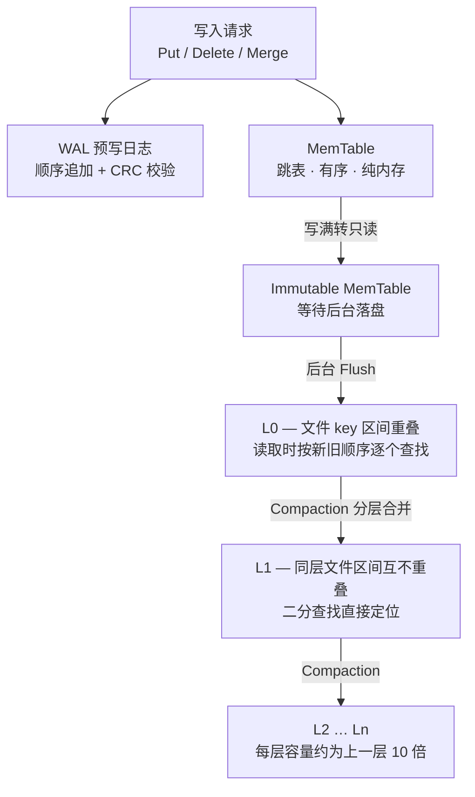
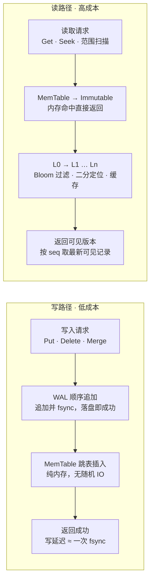

# kvdb 设计文档

> 一个用 Go 实现的高性能嵌入式 KV 存储引擎，架构参考 RocksDB / LevelDB 的 LSM-Tree。
>
> 状态：M0（骨架）、M1（最小可用）、M2（读优化）、M3（写优化）均已完成 ｜ 最后更新：2026-09-18

## 目录

- [1. 项目定位与边界](#1-项目定位与边界)
- [2. 整体架构](#2-整体架构)
- [3. 读写路径](#3-读写路径)
- [4. SSTable 文件格式](#4-sstable-文件格式)
- [5. 功能清单](#5-功能清单)
- [6. 实施路线](#6-实施路线)
- [7. Go 实现建议](#7-go-实现建议)
- [8. 明确不做的](#8-明确不做的)
- [9. 实施进度](#9-实施进度)
- [附录 A：关键数据结构](#附录-a关键数据结构)
- [附录 B：核心接口](#附录-b核心接口)
- [附录 C：包结构](#附录-c包结构)
- [附录 D：关键设计决策](#附录-d关键设计决策)

---

## 1. 项目定位与边界

RocksDB 本体是 40 万行 C++、上百个可调参数。本项目不追求功能对齐，只保留 LSM-Tree 的内核思想，因此需要先把边界划死，否则功能会无限膨胀。

**做：**

- 单机嵌入式存储库（被进程直接链接，不是独立服务，不定义网络协议）
- 单进程访问（用文件锁保证同一目录不被多进程同时打开）
- 有序 KV，支持点查、范围扫描、原子批量写、快照读
- 第一优先级：**顺序写吞吐** 与 **点查延迟**

**不做：**

- 分布式、Raft / Paxos、一致性协议
- 事务隔离级别（SI / SSI）、二级索引
- 加密、审计、鉴权

---

## 2. 整体架构

LSM-Tree 的全部设计思想可以压缩成一句话：**用顺序写换随机写，接受空间放大和读放大**。所有写入只追加到 WAL 和内存，磁盘上永远不原地更新。



### 三个容易被低估的点

**1）WAL 和 MemTable 是并行的两条路，不是先后顺序。**
一次写请求既要追加 WAL（持久化保证），也要插入 MemTable（可读性保证）。WAL 的 fsync 成功是返回客户端的充要条件，MemTable 的插入只是为了让数据可读。理解成"先写日志再写内存"会在实现并发时走弯路。

**2）Immutable MemTable 是必需的，不是优化。**
MemTable 写满后不能就地转成 SST——后台 Flush 需要时间，这段时间里新写入必须继续。所以标准做法是：写满 → 冻结为只读的 Immutable MemTable → 立刻挂上新的空 MemTable 继续接受写入 → 后台线程慢慢把 Immutable 落盘。没有这一层，Flush 期间写入会被全程阻塞。

**3）L0 和其他层的规则不同，这是整个引擎效率的分水岭。**
L0 的文件是 MemTable 直接 Flush 出来的，彼此 key 区间**会重叠**，所以只能按新旧顺序逐个线性查找。L1 以下每层内部文件区间**互不重叠**，才能二分定位。所有 Compaction 策略的设计目标，本质上就是"尽快把 L0 的重叠区间收敛成 L1 的有序不重叠布局"。

---

## 3. 读写路径

两条路径的成本来源完全不同：写路径的成本几乎全在一次 fsync 上，读路径的成本在层数和无效 IO 上。



**写路径的关键在 WAL**：只要 fsync 成功就可以返回，MemTable 操作是纯内存的，所以写是 `O(log n)` 且没有随机 IO。这也意味着**写性能的天花板由 fsync 次数决定**，这是 Group Commit 存在的理由——把并发写请求合并成一次 fsync。

**读路径的代价在层数**：最坏情况下要穿透 MemTable、Immutable 和每一层。所以必须靠两个组件把无效查找挡在外面：

- **Bloom Filter**：每个 SST 一个位图，能在打开文件之前就判定"key 一定不在这个文件里"，挡掉绝大部分无效磁盘 IO。
- **Block Cache**：分片 LRU，缓存解压后的数据块，让热点读不落盘。

> **读到 M3 为止的实际形态**：上面两个组件都已经接上（`internal/filter` + `internal/cache`），
> 每层 SST 内部是"Index 二分 → Bloom 判定 → 读块（先查缓存）→ 块内 seek"。
> **分层也已经长出来了** —— L0 的文件数被 `L0CompactionTrigger` 兜在阈值附近，
> L1 以下同层区间互不重叠，于是每层只需要**一次二分**定位到唯一候选文件，
> "M 个文件就要探 M 次元数据"这件事不再随写入量增长。
> 版本由 Manifest 持久记录（`internal/version`），合并由 `internal/compact` 执行。
> 具体格式见 4.1，实测数据见 9.12 与 9.16。

**Delete 是写操作，不是删除操作。** 它会写入一条带删除标记（墓碑）的记录，真正的物理删除发生在后续 Compaction 归并时。这是 LSM-Tree 不可变性的直接推论。

---

## 4. SSTable 文件格式

SSTable 不是简单地把 KV 顺序写进文件。它必须切块、建索引、加过滤器，才能支持"一块一块地二分查找"而不用全文件扫描。**这是实现量最大的一块。**

| 区块 | 作用 |
|---|---|
| Data Block 0 … N | 有序 KV 对。默认约 4KB 一块，块内用前缀压缩 + 重启点（restart points）降低体积，每块带 CRC32 校验 |
| Filter Block | Bloom 位图，用于在打开块之前判定 key 是否存在 |
| Index Block | 记录每个 Data Block 的首 key 与文件偏移，二分它就能定位到目标块 |
| MetaIndex Block | 指向 Filter Block 及 properties 等元数据区的索引 |
| Footer | 定长，记录 Index Block 与 MetaIndex Block 的位置，是读取文件的入口 |

一次点查的完整链路：读 Footer → 读 Index Block（可缓存）→ 查 Filter Block 判断是否存在 → 二分 Index 定位 Data Block → 读块（先查 Block Cache）→ 块内二分得到记录。

### 4.1 实装细节（M2）

上面是目标形态；M2 已经把它落地，具体编码如下。

```
┌──────────────────────────────────────────────────────────┐
│ Data Block 0                                             │
│   entry... entry... [restart array] [numRestarts(fixed32)]│
│ Data Block 1 … N                                         │
├──────────────────────────────────────────────────────────┤
│ Filter Block                                             │
│   bloom bitmap… │ offset array(fixed32 × N+1) │ baseLg(1B)│
├──────────────────────────────────────────────────────────┤
│ MetaIndex Block   "filter.kvdb.BloomFilter" → Filter handle│
├──────────────────────────────────────────────────────────┤
│ Index Block       block max key → Data Block handle      │
├──────────────────────────────────────────────────────────┤
│ Footer (48B)                                             │
│   MetaIndex handle(变长) + Index handle(变长) + 填充 +    │
│   magic = "kvdb0002"                                     │
└──────────────────────────────────────────────────────────┘
```

- **Data Block 内部**：每条 entry 是 `shared_len:uvarint | unshared_len:uvarint | value_len:uvarint | key_delta | value`，
  前缀压缩的基准是**每 16 条一个的重启点**（`restartInterval = 16`）。重启点数组倒序写在块尾，
  最后跟一个 `fixed32` 的重启点个数。块内查找先二分重启点，再在段内线性扫。
- **块尾（trailer，5 字节）**：`compression_type(1B) + crc32c(4B，掩码后)`。M2 的压缩类型恒为 0（不压缩），
  但长度先按最终形态留出，M5 加压缩不用改格式。
- **Index Block 的 key 是数据块的 max key**（不是首 key），value 是 `blockHandle{offset, size}` 的编码。
  handle 本身是 `uvarint(offset) | uvarint(size)`，长度不含 5 字节块尾。
- **Filter Block 的偏移数组**是 `fixed32 × (N+1)`：末尾多一项"数组自身起点"当哨兵，
  于是"第 i 段的终点"就是第 i+1 项，最后一段正好落在哨兵上，读取时不需要为末段写特判。
- **Footer 定长 48 字节** = 40 字节的 handle 区（两个 handle 顺序写入，剩余补零，读取时校验补零区确实全零）
  \+ 8 字节大端 magic。因此"打开"是先读尾部 48 字节定位两个索引块，再读这两个块 —— 一共三次 pread，
  之后所有点查都不再碰元数据 IO。

**两条硬约束**（正确性所依赖，见 9.13）：

1. **同一个 user key 的所有版本必须落在同一个 Data Block 里** —— 块边界只在 user key 变化时才允许切。
2. **Bloom Filter 建在 user key 上**，不是 internal key（后者带 `(seq, type)` 后缀，每个版本都不同）。

**格式兼容性**：M1 的 SST 是"数据区 + 16B footer（`fixed64(dataLen)` + magic `kvdb0001`）"，
与五段式不兼容。M2 遇到 `kvdb0001` 的文件直接返回 `ErrLegacyFormat`，不尝试解析。

---

## 5. 功能清单

分四档。**MVP 范围只包含前两档。**

| 模块 | 必要性 | 关键内容 |
|---|---|---|
| **WAL 预写日志** | 必做 | 顺序追加、分块、每条 CRC 校验、崩溃重放、flush 完成后可清理 |
| **MemTable** | 必做 | 内存有序表（跳表），并发读 + 单写者，容量阈值触发切换 |
| **SSTable 文件格式** | 必做 | Data / Filter / Index / MetaIndex / Footer 五段式结构 |
| **Manifest + Version** | 必做 | 版本变更日志 + CURRENT 指针 + 引用计数，崩溃一致性的根 |
| **Compaction** | 必做 | 选文件 → 多路归并 → 原子替换 Version |
| **internal key 编码** | 必做 | `user_key + 8 字节 (seq<<8 \| type)`，Comparer 可插拔 |
| **Put/Get/Delete/Iterator** | 必做 | Delete 写墓碑；Iterator 用 MergingIterator 做多路归并 |
| **崩溃恢复** | 必做 | 重放 WAL + 从 Manifest 重建 VersionSet |
| **Bloom Filter** | 强烈建议 | 每个 SST 一个 filter block，挡掉绝大部分无效磁盘 IO |
| **Block Cache** | 强烈建议 | 分片 LRU，缓存解压后的数据块 |
| **WriteBatch** | 强烈建议 | 一次 WAL append 完成多条写，顺带拿到原子性 |
| **Snapshot / MVCC** | 强烈建议 | 序列号 + 快照读。**建议一开始就在 key 里留 seq 字段**，后补代价极大 |
| **Group Commit** | 建议 | 并发写合并成一次 fsync，高并发吞吐的关键 |
| **块压缩** | 建议 | Snappy / LZ4 / ZSTD，块级压缩 |
| **Metrics / LOG** | 建议 | 命中率、各层文件数、读写放大倍数 |
| **Rate Limiter** | 可选 | 限制 compaction 带宽，避免挤压前台请求 |
| **Column Family** | 可选 | 多列族共享 WAL，各自独立 MemTable / SST |
| **事务 / TTL / 加密** | 可选 | 单机 KV 初期全都用不上 |

---

## 6. 实施路线

每个阶段都有明确的验收标准，避免"写了很多代码但不知道对不对"。当前进度见 [9. 实施进度](#9-实施进度)。

| 阶段 | 交付内容 | 验收标准 | 状态 |
|---|---|---|---|
| **M0 骨架** | Options / Comparer / varint / internal key 编解码 | 编解码单测全绿 | 已完成 |
| **M1 最小可用** | WAL + MemTable（跳表） + 简单 SST + Get/Put/Delete + 崩溃恢复 | 单线程 10 万次读写结果正确；`kill -9` 后数据不丢 | 已完成 |
| **M2 读优化** | Index Block + Bloom + Block Cache + Iterator | 点查不触发全文件扫描；范围扫描可用 | 已完成 |
| **M3 写优化** | Flush + Leveled Compaction + Manifest/Version | L0 文件数收敛在阈值附近；读放大不随写入量增长 | 已完成 |
| **M4 一致性** | Snapshot + WriteBatch + Group Commit | 并发压测下 race detector 无告警 | 未开始 |
| **M5 生产化** | 块压缩 + 限流 + Metrics + Checkpoint | 跑通 YCSB 并输出基准报告 | 未开始 |

建议先把 M0 + M1 打通成一条完整链路，哪怕 SST 只有一个文件、查找用线性扫描——**能跑通"写入→崩溃→恢复→读回"这条闭环，比先把 SST 做得多漂亮重要得多。**

---

## 7. Go 实现建议

### 参考资料

| 项目 | 价值 |
|---|---|
| **cockroachdb/pebble** | 最值得读。RocksDB 血统的 Go 生产级实现，`internal/` 目录几乎与上表每个模块一一对应 |
| **dgraph-io/badger** | 另一条路线（KV 分离到 value log），写放大更低，但范围查询弱 |
| **LevelDB `doc/table_format.md`** | 吃透 SSTable 字节布局最快的一份材料 |

推荐读法：先照 LevelDB 文档把 SSTable 字节格式读透，再对照 pebble 的 `internal/` 看工程实现。

### 依赖策略

第三方库**只用在工具层**，存储引擎主体自己写，否则这个项目就失去了意义。

- 可以用：`github.com/cespare/xxhash`、`github.com/golang/snappy`、`github.com/klauspost/compress`、`github.com/bits-and-blooms/bloom`
- 建议自己写：跳表（约 400 行）、块编解码、Manifest 读写、Compaction
- 跳表也可以先用 `github.com/google/btree` 顶一阵，但要注意 B-Tree 的写并发控制与 LSM 的"无锁读 + 单写者"模型不完全匹配

---

## 8. 明确不做的

这些属于"另一个项目"，初期碰它们会直接拖垮进度：

- 分布式 / Raft / 网络协议
- 事务隔离级别（SI / SSI）、多版本并发控制的完整实现
- 二级索引、加密、审计
- 多进程并发访问同一目录（文件锁兜住即可）
- 兼容 RocksDB 的 API 或磁盘格式

---

## 9. 实施进度

### 9.1 阶段状态

| 阶段 | 状态 | 完成时间 | 依据 |
|---|---|---|---|
| M0 骨架 | **已完成** | 2026-09-18 | `go test ./...` 全绿，见 9.4 |
| M1 最小可用 | **已完成** | 2026-09-18 | 10 万次读写正确 + 子进程强杀后数据不丢，见 9.8 |
| M2 读优化 | **已完成** | 2026-09-18 | 点查不再全文件扫描 + 范围扫描可用 + 读延迟的线性项被压掉约 3 个数量级，见 9.12 |
| M3 写优化 | **已完成** | 2026-09-18 | L0 文件数被钉在触发阈值附近 + 读放大收敛为常数 + 崩溃/迁移路径均可恢复，见 9.16 |
| M4 一致性 | 未开始 | — | — |
| M5 生产化 | 未开始 | — | — |

### 9.2 M0 交付物

| 文件 | 内容 |
|---|---|
| `go.mod` | 模块声明：`module kvdb`，`go 1.23` |
| `doc.go` | 包级文档 |
| `options.go` | `Options` 全量字段与默认值、`Comparer` 接口、`BytewiseComparer`、internal key 比较器叠加、`levelMaxBytes` |
| `options_test.go` | Options 默认值 / 校验 / 比较器可插拔性单测 |
| `internal/key/varint.go` | uvarint、zigzag varint、fixed32/64 编解码与三类错误值 |
| `internal/key/internal_key.go` | `Kind`、trailer 打包、internal key 编解码、`InternalKeyCompare`、`SeekKey` |
| `internal/key/varint_test.go` | varint 编解码单测（含与标准库逐字节交叉校验） |
| `internal/key/internal_key_test.go` | 字节布局、错误处理、排序语义、`SeekKey` 可见性语义单测 |
| `.gitignore` | 忽略测试产物与本地数据目录 |

### 9.3 M0 API 一览

```go
// ── package kvdb（options.go）

const DefaultMemTableSize = 64 << 20 // 另有 BlockSize / BlockCacheSize / BloomBitsPerKey /
                                     // L0CompactionTrigger / LevelBaseSize /
                                     // LevelSizeMultiplier / MaxLevels

type Comparer interface {
    Compare(a, b []byte) int // -1 / 0 / +1
    Name() string            // 稳定标识，后续写入 Manifest 校验目录与配置是否匹配
}

type BytewiseComparer struct{} // 默认比较器，等价 bytes.Compare

type Options struct {
    Dir                 string
    Comparer            Comparer
    MemTableSize        int
    BlockSize           int
    BlockCacheSize      int
    BloomBitsPerKey     int
    L0CompactionTrigger int
    LevelBaseSize       int
    LevelSizeMultiplier int
    MaxLevels           int
    SyncWrites          bool
}

func DefaultOptions(dir string) Options // 字段全部填好
func (o *Options) Validate() error      // 只校验，不填默认值

// ── package kvdb/internal/key

// varint.go
func PutUvarint(dst []byte, x uint64) []byte
func Uvarint(buf []byte) (value uint64, n int, err error)
func UvarintLen(x uint64) int
func PutVarint(dst []byte, x int64) []byte
func Varint(buf []byte) (value int64, n int, err error)
func VarintLen(x int64) int
func PutFixed32(dst []byte, x uint32) []byte
func Fixed32(buf []byte) (uint32, error)
func PutFixed64(dst []byte, x uint64) []byte
func Fixed64(buf []byte) (uint64, error)

// internal_key.go
type Kind uint8 // TypeDeletion = 0 / TypeValue = 1
const TrailerLen = 8
const MaxSeqNum uint64 = (1 << 56) - 1

func MakeTrailer(seq uint64, kind Kind) uint64
func AppendInternalKey(dst, userKey []byte, seq uint64, kind Kind) []byte
func EncodeInternalKey(userKey []byte, seq uint64, kind Kind) []byte
func DecodeInternalKey(ik []byte) (userKey []byte, seq uint64, kind Kind, err error)
func ParseInternalKey(ik []byte) (ParsedInternalKey, error)
func UserKey(ik []byte) []byte
func Trailer(ik []byte) uint64
func SeqNum(ik []byte) uint64
func KindOf(ik []byte) Kind
func SeekKey(userKey []byte, snapshot uint64) []byte
func InternalKeyCompare(a, b []byte, userCmp func(a, b []byte) int) int
```

### 9.4 M0 验收结果

M0 的验收标准是"编解码单测全绿"，实测：

```text
$ gofmt -l .            # 无输出
$ go vet ./...          # 无输出
$ go test ./... -cover
ok      kvdb                 1.25s   coverage: 100.0% of statements
ok      kvdb/internal/key    1.27s   coverage:  98.9% of statements
```

- 测试函数 35 个（含子测试共 54 个用例），**全部 PASS，0 FAIL**。
- 关键断言覆盖：
  - uvarint / zigzag varint 的编码结果与 `encoding/binary` **逐字节一致**，长度函数与实际编码长度一致（避免"自己编自己解"的循环验证）；
  - fixed32/fixed64 的大端字节布局、长度不足时的错误；
  - varint 截断 / 溢出边界（第 10 字节为 1 时恰好是合法上界 `1<<63`，为 2 时溢出）；
  - internal key 尾缀的字节布局（`"foo" + 00 00 00 00 00 00 0a 01`）、`seq` 超过 56 位时 panic；
  - 排序规则：`user_key` 升序 + 尾缀降序，并验证反对称性与自定义比较器真正生效；
  - `SeekKey` 在 5 个快照点上全部落在正确版本——包含"墓碑的 seq 恰好等于快照 seq"这一容易写错的边界。
- `go test -race` 在当前环境不可用（`go: -race requires cgo`）；M0 无并发代码，留到 M4 在启用 CGO 的环境补验。
- 验证环境：`go1.27.1 windows/amd64`。

### 9.5 M0 期间新增 / 细化的决策

| 决策 | 说明 |
|---|---|
| `Comparer` 用接口而非函数字段 | 接口能带 `Name()`，可写入 Manifest 校验"数据目录与配置是否匹配"；裸函数字段做不到 |
| `MakeTrailer` 对 `seq > MaxSeqNum` 直接 panic | 静默截断会破坏排序前提、产生难以定位的数据错乱，这类调用方错误应当立刻暴露 |
| `SeekKey` 尾缀用 `(snapshot, TypeValue)` | 尾缀降序排列下它是"seq ≤ snapshot 的全部版本"中最大者，seek 落点恰好是最新可见版本；用单测锁定了 `seq == snapshot` 的墓碑也能被命中 |
| Options 数值字段：`0` = 用默认值，负数 = 关闭可选特性 | `BlockCacheSize` / `BloomBitsPerKey` 需要"显式关闭"的语义，用负数表达才不会和"用默认值"混淆 |
| 二进制编码全程大端 | 与 LevelDB 的 trailer / fixed 编码一致，便于对照 `doc/table_format.md` 排查问题 |
| varint 与 internal key 同放 `internal/key` | 沿用附录 C 的规划；varint 后续主要由 sst 块编码消费，暂不单独拆包 |
| 访问器与校验解码分开 | `UserKey` / `SeqNum` / `KindOf` 是零成本尽力而为的访问器；`DecodeInternalKey` / `ParseInternalKey` 会校验长度与 kind，用于磁盘读回后的完整性检查 |

### 9.6 M1 交付物

M1 的目标不是功能齐全，而是**把"写入 → 崩溃 → 恢复 → 读回"这条闭环跑通**。
因此 SST 只有一个文件的线性扫描版本，索引、Bloom、缓存、分层压缩全部留给后面。

| 文件 | 内容 |
|---|---|
| `db.go` | `DB`：`Open / Close / Get / Put / Delete / Write`、目录锁、冻结 Immutable、`Stats`、`RecoveryReport` |
| `db_flush.go` | 目录扫描恢复、WAL 重放、后台 Flush 协程、SST 落盘、过期日志清理 |
| `batch.go` | `WriteBatch` 与它的二进制编解码（WAL 的负载就是它） |
| `file_lock_windows.go` / `file_lock_unix.go` | 目录锁：Windows 用 `LockFileEx`，类 Unix 用 `flock` |
| `db_test.go` | 读写语义、10 万次读写、多次落盘、重开恢复、目录锁、并发读写、半截文件丢弃 |
| `db_crash_test.go` | 用子进程"写完直接退出"模拟 `kill -9`，覆盖干净崩溃与日志尾部损坏两种情形 |
| `batch_test.go` | 批次字节布局、往返、损坏输入拒绝 |
| `internal/memdb/skiplist.go` | 跳表：单写者 + 多读者，无锁读 |
| `internal/memdb/memtable.go` | MemTable：internal key 存储、快照可见性、近似内存统计 |
| `internal/wal/writer.go` | 分块日志写入：CRC32C、类型拆分、块尾补零 |
| `internal/wal/reader.go` | 分块日志读取：片段重组、损坏定位 |
| `internal/wal/wal.go` | 编号日志文件：追加、fsync、重放、目录扫描与删除 |
| `internal/sst/writer.go` | 最小 SST 写入：顺序 entry + 定长 footer |
| `internal/sst/reader.go` | 最小 SST 读取：footer 校验 + 线性扫描 |
| `internal/key/comparer.go` | `Comparer` 接口与 `InternalComparer`（根包与内部包共用一份实现） |
| `cmd/kvdb-bench/main.go` | 压测工具雏形：顺序写吞吐、点查延迟、恢复报告 |
| `scripts/gotest.ps1` | 本机跑 `go test` 的小脚本（把输出写进日志，规避 PowerShell 不回显 stdout） |

### 9.7 M1 API 一览

```go
// ── package kvdb（db.go / batch.go）

type Options struct { /* 同 M0 */ }

func Open(opts Options) (*DB, error)
func (db *DB) Get(key []byte) ([]byte, error)          // 不存在或已删除 → ErrNotFound
func (db *DB) Put(key, value []byte) error
func (db *DB) Delete(key []byte) error
func (db *DB) Write(b *WriteBatch) error               // 唯一写入口
func (db *DB) Close() error
func (db *DB) Stats() Stats                            // 文件数、MemTable 占用、末序列号
func (db *DB) RecoveryReport() RecoveryReport          // 被截断的日志、被丢弃的文件

var ErrNotFound error
var ErrClosed error
var ErrLocked error
var ErrEmptyKey error
var ErrBatchCorrupt error

func NewWriteBatch() *WriteBatch
func (b *WriteBatch) Put(key, value []byte) error
func (b *WriteBatch) Delete(key []byte) error
func (b *WriteBatch) Len() int
func (b *WriteBatch) Reset()
func (b *WriteBatch) Sequence() uint64
func (b *WriteBatch) SetSequence(seq uint64)
func (b *WriteBatch) Encode() []byte
func (b *WriteBatch) EncodeTo(dst []byte) []byte
func (b *WriteBatch) Range(start uint64, fn func(seq uint64, kind key.Kind, k, v []byte) bool) error

// ── package kvdb/internal/memdb
func New(cmp key.Comparer, logNum uint64) *MemTable
func (m *MemTable) Add(seq uint64, kind key.Kind, userKey, value []byte)
func (m *MemTable) Get(snapshot uint64, userKey []byte) (value []byte, kind key.Kind, found bool)
func (m *MemTable) NewIterator() *Iterator
func (m *MemTable) ApproximateSize() int64
func (m *MemTable) LogNumber() uint64

// ── package kvdb/internal/wal
func Create(dir string, num uint64) (*Log, error)
func (l *Log) Append(record []byte) error
func (l *Log) Sync() error
func (l *Log) Close() error
func (l *Log) Remove() error
func Replay(dir string, num uint64, fn func(record []byte) error) (ReplayResult, error)
func ListLogs(dir string) ([]uint64, error)
func RemoveLog(dir string, num uint64) error

// ── package kvdb/internal/sst
func NewWriter(path string, cmp key.Comparer) (*Writer, error)
func (w *Writer) Add(internalKey, value []byte) error
func (w *Writer) Finish() error
func Open(path string, cmp key.Comparer) (*Reader, error)
func (r *Reader) Get(snapshot uint64, userKey []byte) (value []byte, kind key.Kind, found bool, err error)
func (r *Reader) Iterate(fn func(internalKey, value []byte) bool) error

// ── package kvdb/internal/key（M1 新增）
type Comparer interface{ Compare(a, b []byte) int; Name() string }
type InternalComparer struct{ User Comparer }
func (c InternalComparer) Compare(a, b []byte) int
func (c InternalComparer) UserCompare(a, b []byte) int
```

### 9.8 M1 验收结果

验收标准是"单线程 10 万次读写结果正确；`kill -9` 后数据不丢"，两条都用测试锁住了：

```text
$ gofmt -l .            # 无输出
$ go vet ./...          # 无输出
$ GOOS=linux go build ./...   # 无输出（交叉编译验证 Unix 分支的目录锁）

$ go test ./... -count=1 -cover
ok      kvdb                    5.64s   coverage: 89.3% of statements
ok      kvdb/internal/key       1.18s   coverage: 98.1% of statements
ok      kvdb/internal/memdb     1.49s   coverage: 100.0% of statements
ok      kvdb/internal/sst       1.72s   coverage: 80.5% of statements
ok      kvdb/internal/wal       1.59s   coverage: 85.1% of statements
```

**1）单线程 10 万次读写正确**

`TestHundredThousandWritesAndReads`：顺序写 10 万条 → 覆盖其中的一半 → 再删除四分之一 →
逐条读回并校验"已删除 / 已更新 / 原值"三种状态，全部吻合。总耗时 1.3s。

**2）`kill -9` 后数据不丢**

同进程里"不调用 Close"证明不了什么：目录锁挂在内核持有的文件句柄上，只有进程真的死了才会释放。
所以用子进程做实验（`db_crash_test.go`）：子进程用 `Open(DefaultOptions(dir))`（`SyncWrites = true`）
写入 300 条记录，**不做任何清理就 `os.Exit(1)`**，父进程再重新打开并逐条校验。

覆盖两种崩溃形态：

| 用例 | 崩溃形态 | 期望 |
|---|---|---|
| `TestCrashRecoveryKeepsSyncedWrites` | 写完立刻被杀 | 300 条全部读回，`RecoveryReport.TornLogs` 为空 |
| `TestCrashRecoveryToleratesTornLogTail` | 日志尾部被追加 3 个垃圾字节 | 损坏点之前的 200 条全部读回，`TornLogs` 如实报告该日志 |

两条都额外验证了"恢复之后还能继续正常读写"——崩溃不会把数据库留在不可用状态。

**3）落盘与恢复的组合路径**

- `TestDataSurvivesFlushes`：把 `MemTableSize` 压到 8KB，写 1200 条，强制反复"冻结 → 落盘"，
  数据要在 MemTable / Immutable MemTable / 多个 SST 三种位置之间切换后依然全部可读；
  关闭再打开（走 WAL 重放 + 恢复落盘）后逐条复核。
- `TestRecoveryDiscardsUnfinishedFlush`：伪造一个 footer 不全的 `000009.sst`（对应"Flush 写到一半被杀"），
  恢复时必须丢弃它——它的数据仍在 WAL 里——并把它记进 `RecoveryReport.DiscardedFiles`。
- `TestDirectoryLock`：同目录第二次 `Open` 返回 `ErrLocked`；`Close` 之后 LOCK 文件仍在目录里，但必须能立刻重新打开。

**4）性能观感（`cmd/kvdb-bench`，本机 Windows / go1.27.1，`SyncWrites = false`）**

```text
memtable size 1MB, 20000 keys, value 100B:
  write  111ms  (180422 ops/s, 5.54 us/op)      # 3 次冻结 + 落盘
  read   5.09s  (  3930 ops/s, 254.48 us/op)    # 3 个 SST，每个 Get 都要线性扫
```

写入侧的 5.5 µs/op 说明"顺序追加 + 跳表插入"这条路径本身很快；
读侧的 254 µs/op 则是 M1 刻意留下的坑：**没有索引，文件里的查找是线性扫描**，
点查成本随 SST 数量线性增长。这正是 M2 要解决的问题，数据摆在这里比任何论证都有说服力。

### 9.9 M1 期间新增 / 细化的决策

| 决策 | 说明 |
|---|---|
| 恢复时**强制把重放结果落成 SST** | 否则重放出的 MemTable 一落盘就会连带删掉旧日志，而这段数据还没有别的副本。先落盘再删日志，删日志的判据才能简单到"编号 < min(mem, imm) 的日志" |
| 崩溃时中断的 Flush 直接删除 | 它没有 footer，所以一定没被提交过；数据仍完整地躺在 WAL 里，随重放重新落盘。M3 有了 Manifest 之后，"未提交文件"由版本信息判定 |
| 目录锁用 OS 级锁（`LockFileEx` / `flock`），不用 `O_EXCL` 锁文件 | `O_EXCL` 会在进程被强杀后留下打不开的死锁文件，直接毁掉崩溃恢复路径；OS 锁随进程消亡自动释放 |
| 同一时刻只允许一张 Immutable MemTable | 写者在冻结时最多等到上一张落盘完成，实现简单且内存有上界；多张 Immutable 的并行落盘留给 M3 |
| 序列号写进 WriteBatch 头部，恢复时原样沿用 | 恢复期重新分配序列号会让同一目录在不同次恢复后得到不同的版本顺序，快照语义随之崩坏 |
| `Close` 不落盘 MemTable | 数据本来就在 WAL 里，下次 `Open` 重放即可。好处是 Close 快、且"恢复"路径每次打开都必然跑一遍，不容易腐烂 |
| 日志尾部损坏 = 可容忍，文件中间损坏 = 不可容忍 | 前者是崩溃的半截写，丢弃即可；后者说明后面的字节不可信，必须报错而不是继续重放 |
| WAL 记录头校验覆盖"类型字节 + 负载" | 只校验负载的话，类型字段被翻转会得到一条看似完好、语义错乱的记录 |
| `MemTable.Get` 返回 `(value, kind, found)` | 三态（不存在 / 墓碑 / 数据）用 `key.Kind` 表达，比多布尔量清晰；SST 的 `Get` 用同一组返回值 |
| `Comparer` 与 `InternalComparer` 下沉到 `internal/key` | 根包与内部包都要用它，放在内部包可以避免根包被反向依赖；根包保留 `internalComparer` 别名 |
| 文件编号在 SST 与日志之间共享 | `编号大 = 更新` 这一条规则同时对两种文件成立，L0 的"从新到旧"查找顺序才有依据 |

### 9.10 M2 交付物

M1 把闭环跑通了，但读路径还是"每个文件线性扫一遍"。M2 的目标是**让点查不触发全文件扫描**。
这一阶段没有引入任何新的持久化状态（没有 Manifest，没有 Compaction），全部改动都是"把已有的
SST 文件从线性数组改成可分块定位的结构"，因此**旧格式的 SST 文件不再可读**，magic 从
`kvdb0001` 升到 `kvdb0002`，遇到旧文件直接报 `ErrLegacyFormat` 而不是尝试解析。

| 文件 | 内容 |
|---|---|
| `internal/crc/crc.go` | CRC32C（Castagnoli）+ LevelDB 掩码算法的共用实现，WAL 与 SST 共用一份 |
| `internal/filter/bloom.go` | Bloom 哈希（LevelDB 版，小端取字节）与位图置位 / 判定 |
| `internal/filter/block.go` | Filter Block：按 2KB 切段的 Bloom 位图 + 偏移数组 + `baseLg` 字节；写侧 `BlockBuilder`、读侧 `BlockReader` |
| `internal/cache/lru.go` | 16 分片 LRU 块缓存，按 `(fileNum, offset)` 索引、按字节计费；`New(0)` 返回 nil，nil 缓存是安全的空操作 |
| `internal/sst/format.go` | 常量（Footer 长度、magic、块尾长度、重启点间隔）与 Footer 编解码、错误值 |
| `internal/sst/block.go` | Data Block 读写：前缀压缩 + 重启点（每 16 条一个）；块内先二分重启点再线性扫 |
| `internal/sst/writer.go` | 五段式写入：Data Block → Filter → MetaIndex → Index → Footer；块尾带 1 字节压缩类型 + 4 字节 CRC |
| `internal/sst/reader.go` | 打开时载入 Index / MetaIndex（各几 KB）；`Get` 走 **Index 二分 → Bloom 判定 → 读块（先查缓存）→ 块内 seek** |
| `internal/sst/iterator.go` | SST 级迭代器：按需加载数据块，跨块自动推进 |
| `internal/iterator/iterator.go` | 统一的只读迭代器接口（MemTable / SST 都实现它） |
| `internal/iterator/merging.go` | `MergingIterator`：对多个子迭代器做最小堆归并，顺序即"新 → 旧" |
| `internal/iterator/dbiter.go` | `DBIter`：在归并流之上做快照可见性过滤、墓碑屏蔽、同 key 去重、上下界裁剪 |
| `db_iter.go` | `DB.NewIterator` / `DB.GetSnapshot` / `Snapshot` / 导出 `Iterator` 接口 / `IteratorOptions` |
| `internal/crc/crc_test.go` | 掩码往返、与标准库 crc32c 交叉校验、增量更新等价性 |
| `internal/filter/filter_test.go` | 无假阴性（硬保证）、假阳性率、哈希分散度、分段语义、损坏容错 |
| `internal/cache/lru_test.go` | nil 安全、命中/未命中、容量上限、LRU 顺序、并发访问、分片分散度 |
| `internal/sst/block_test.go` | 前缀压缩、重启点、Seek 边界、损坏拒绝、entry 字节布局 |
| `internal/sst/sst_test.go` | 往返、快照/墓碑、多块、**版本同块**、索引记 max key、**点查只读一个块**、过滤器可选、缓存生效、块与索引损坏检测、旧格式拒绝、Footer 布局、空文件、大 value |
| `internal/iterator/iterator_test.go` | 归并顺序/Seek/错误传播；DBIter 的跨层可见性、边界、去重 |
| `db_iter_test.go` | 全源归并、快照隔离、快照跨 Flush 存活、Seek 与边界、Get 返回独立副本、缓存统计、关闭后的迭代器、空库 |
| `cmd/kvdb-bench/main.go` | 从"只测写+顺序读回"扩成 `write / point / scan / sweep` 四种模式，带 Bloom 与缓存的对照组 |

### 9.11 M2 API 一览

```go
// ── package kvdb（db_iter.go）

func (db *DB) NewIterator(opt *IteratorOptions) Iterator
func (db *DB) GetSnapshot() *Snapshot

type Iterator interface {          // 面向 user key 的只读有序迭代器，只支持前向
    SeekToFirst()
    Seek(target []byte)
    Valid() bool
    Key() []byte                   // 只在下次 Seek/Next/Close 前有效，且不得修改
    Value() []byte
    Next()
    Error() error
    Close() error
}

type IteratorOptions struct {
    LowerBound []byte              // 含
    UpperBound []byte              // 含；与 LevelDB 的 ReadOptions 一致，是闭区间
}

type Snapshot struct{ /* 只记一个序列号，不复制数据、不阻塞写入 */ }
func (s *Snapshot) Seq() uint64
func (s *Snapshot) Get(userKey []byte) ([]byte, error)
func (s *Snapshot) NewIterator(opt *IteratorOptions) Iterator
func (s *Snapshot) Release()       // M2 只是标记失效；序列号回收是 M4 的事

// Stats 新增的读路径指标
//   CacheHits / CacheMisses / CacheBytes / CacheItems

var ErrSnapshotReleased error

// ── package kvdb/internal/cache
func New(size int) *Cache                          // size <= 0 → nil（空操作）
func (c *Cache) Get(fileNum, offset uint64) ([]byte, bool)
func (c *Cache) Put(fileNum, offset uint64, block []byte)
func (c *Cache) Stats() Stats                      // Hits / Misses / Bytes / Count
const NumShards = 16

// ── package kvdb/internal/filter
func NewBlockBuilder(bitsPerKey int) *BlockBuilder
func (b *BlockBuilder) AddKey(userKey []byte)      // 注意：喂的是 user key，不是 internal key
func (b *BlockBuilder) StartBlock(blockOffset uint64)
func (b *BlockBuilder) Finish() []byte
func NewBlockReader(contents []byte) *BlockReader
func (r *BlockReader) KeyMayMatch(blockOffset uint64, userKey []byte) bool
func (r *BlockReader) NumRegions() int
func Hash(key []byte) uint32
const PolicyName = "kvdb.BloomFilter"

// ── package kvdb/internal/sst
type WriterOptions struct {
    BlockSize       int
    BloomBitsPerKey int            // 0 → 不建 Filter Block
}
func NewWriter(path string, cmp key.Comparer, opts WriterOptions) (*Writer, error)
func (w *Writer) Add(ik, value []byte) error       // ik 是 internal key；要求严格升序
func (w *Writer) Finish() error
func (w *Writer) Abandon()                         // 放弃并删除半成品文件

type OpenOptions struct {
    Comparer key.Comparer
    Cache    *cache.Cache          // nil → 不走缓存
    FileNum  uint64                // 缓存的键要带文件号
}
func Open(path string, o OpenOptions) (*Reader, error)
func (r *Reader) Get(snapshot uint64, userKey []byte) (value []byte, kind key.Kind, found bool, err error)
func (r *Reader) NewIterator() *Iterator
func (r *Reader) NumBlocks() int
func (r *Reader) FilterEnabled() bool
func (r *Reader) Close() error

var ErrBadFooter error               // footer 不完整 / magic 不对
var ErrLegacyFormat error            // M1 的 kvdb0001 格式
var ErrCorruptBlock error            // 块 CRC 校验失败

// ── package kvdb/internal/iterator
type Iterator interface { /* 与 kvdb.Iterator 同构，内部包用 */ }
func NewMerging(cmp key.InternalComparer, children ...Iterator) *MergingIterator
func NewDBIter(icmp key.InternalComparer, mi Iterator, snapshot uint64, lower, upper []byte) *DBIter
```

### 9.12 M2 验收结果

验收标准三条：**① 点查不触发全文件扫描；② 范围扫描可用；③ `kvdb-bench` 的读延迟不再随文件数线性增长。**

**① 点查不触发全文件扫描** — 由两条证据支撑：

- 单测 `TestPointLookupReadsASingleBlock`：统计一次 `Get` 实际读了多少个数据块，要求恒为 1。
  这条断言就是"不全文件扫描"的形式化表达，回归时会被守住。
- 块尾 CRC + 打开时校验 Index：读路径只碰 Footer / Index / MetaIndex（打开时一次性载入，各几 KB）
  与**一个**数据块。

**② 范围扫描可用** — `MergingIterator` 把 MemTable、Immutable、以及从新到旧的 SST 归并成一条流，
`DBIter` 在其上做可见性 / 墓碑 / 去重 / 边界处理。100 万次量级的扫描在 bench 里跑到 **0.06–0.15 µs/key**，
且 `TestDBIter*` 覆盖了跨层可见性、Seek 语义、闭区间边界、同 key 多版本只出一次。

**③ 读延迟不再随文件数线性增长** — `kvdb-bench -mode sweep` 的实测（10 万 key、value 100B、
随机点查 9 万次 + 负向查询 1 万次、seed 固定）：

| target 文件数 | 实际 sst files | get(hit) | get(miss) | 缓存命中率 |
|---|---|---|---|---|
| 1 | 1 | 2.55 µs | 0.66 µs | 77.4% |
| 2 | 2 | 2.63 µs | 0.87 µs | 77.4% |
| 4 | 4 | 2.84 µs | 1.45 µs | 77.6% |
| 8 | 8 | 2.99 µs | 2.84 µs | 78.1% |
| 16 | 17 | 4.33 µs | 4.11 µs | 74.9% |
| 32 | 34 | 6.11 µs | 7.05 µs | 76.7% |
| 64 | 69 | 11.17 µs | 13.93 µs | 79.0% |

拟合 `get(hit) ≈ 2.22 + 0.126 × files`。**文件数 ×69、延迟 ×4.4** —— 不再是同倍增长。

同一份数据、关掉 Bloom 与块缓存再跑一遍（用来确认曲线变平确实是这两个优化的功劳，
而不是"文件数不够多所以看不出来"）：

| target 文件数 | 实际 sst files | get(hit)（无 Bloom / 无缓存） |
|---|---|---|
| 1 | 1 | 9.27 µs |
| 4 | 4 | 15.90 µs |
| 16 | 17 | 49.15 µs |
| 64 | 69 | 168.11 µs |

拟合 `get(hit) ≈ 7.94 + 2.354 × files`，**线性项系数涨了 18.7 倍**；69 个文件时
168.11 µs vs 11.17 µs，**差 15 倍**。

**与 M1 的同口径对比**：M1 在 3 个 SST、同样 10 万 key / value 100B 下的顺序读回是
**3930 ops/s（254 µs/op）**（记录于 M1 验收，见 9.8）；M2 在 4 个 SST 下同一操作的读回是
**1.72 µs/op**，相差约 **148 倍**。这个对比是"同一台机器、同一操作、同一数据规模"的口径，
因为 M1 的读延迟里绝大部分是逐条解码全文件。

**一句话结论**：M2 之后，一次点查的成本 ≈ **一次数据块读取（常数项，约 2 µs）**
\+ **每多一个文件一次内存里的元数据探测（0.126 µs）**。线性项没有归零 —— M2 没有 Compaction，
L0 文件数无上限，这个线性项要等 M3 的 `L0CompactionTrigger` 才被兜住。
但它的**量级**已经从"每文件一次全文件扫描"变成"每文件一次 Bloom 判定"，
这就是验收标准里说的"不再线性增长"的实际含义。

**测试与静态检查**：`go test ./... -count=1 -cover` 全绿（kvdb 89.6%、cache 96.8%、crc 100%、
filter 94.4%、iterator 86.1%、key 98.1%、memdb 98.6%、sst 79.5%、wal 84.9%）；
`go vet ./...` 与 `gofmt -l` 无输出；`go test -race ./...` 全绿，无 data race 报告 ——
M2 新增的并发结构（分片 LRU 的 16 个分片各自加锁、多个 goroutine 并发读同一 SST 的块缓存路径）
通过了竞态检测。

### 9.13 M2 期间新增 / 细化的决策

| 决策 | 结论与理由 |
|---|---|
| **同一 user key 的所有版本必须落在同一个 Data Block 里** | 块边界只在 user key 变化时才允许切。这是"seek 到一个块就能找到可见版本"的正确性前提：如果同一个 key 的 v1/v3 分在相邻两块，点查只读一块就会读不到快照可见的版本。代价是单个块可能超出 `BlockSize`，可接受。单测 `TestVersionsOfOneKeyStayInOneBlock` 守住。 |
| **Bloom Filter 建在 user key 上，不建在 internal key 上** | internal key 带 `(seq, type)` 后缀，每次更新都会生成一个新 key，用它建 Bloom 等于每个版本都占一份位图，且"key 存在吗"这个问题会被旧版本的位图错误回答。Filter Block 里必须记 user key。 |
| **Filter Block 按 2KB 切段（`BaseLg=11`），段与数据块偏移对应** | 沿用 LevelDB 的做法：一块数据块对应一段 Bloom 位图。判定时先由块偏移算出段号，只查那一段的位图，避免为了一个 key 去碰整张位图（大文件下能把一次判定限制在几百字节内）。`StartBlock` 在写侧记录段边界。 |
| **Bloom 命中"文件损坏"时返回"可能存在"** | 读 Filter Block 解析失败时不报错、也不返回"肯定不存在"，而是保守地当作"可能在"。理由是过滤器只是加速器，不能因为元数据损坏就把一次本来能成功的读判成 miss（那会变成静默的数据丢失）。真正的完整性由数据块的 CRC 把关。 |
| **块尾 = 内容 + 1 字节压缩类型 + 4 字节 CRC32C（掩码后）** | 和 WAL 记录的校验方式统一走 `internal/crc`。M2 还没实装压缩，但长度先按最终形态留出来，M5 加 Snappy 时不需要改格式。 |
| **Footer 定长 48 字节，magic 升到 `kvdb0002`** | `MetaIndex handle + Index handle + 填充 + magic`。换 magic 是刻意的：五段式格式与 M1 的"数据区 + footer"不兼容，遇到 `kvdb0001` 直接报 `ErrLegacyFormat`，比解析出错再报 CRC 失败好定位得多。 |
| **Index 与 MetaIndex 在 `Open` 时一次性读进内存** | 各几 KB，换来"点查不需要任何额外元数据 IO"。打开成本换查询成本，对小文件数场景（L0）是明显划算的。 |
| **索引里记的是"块的最大 key"（max key），不是首 key** | 与 LevelDB 一致：`seekIndex` 找第一个 `max key >= target` 的块，配合"块内再 seek"不会漏。记首 key 在"target 落在块之间空隙"时容易定位错块。单测 `TestIndexRecordsBlockMaxKeys` 守住。 |
| **块缓存的键是 `(fileNum, offset)`，按字节计费，16 分片** | 只用 offset 会在文件编号复用时串味（删了又建的编号相同的文件）。分片用 splitmix64 的 fmix 打散**对齐后**的偏移 —— 数据块偏移都是 4KB 对齐的，直接取低位会让相邻块全落进同一个分片。 |
| **`cache.New(size<=0)` 返回 nil，并在所有方法上容忍 nil 接收者** | 让"关缓存"这条路径完全不需要分支：`Options.BlockCacheSize < 0` 归一化成 0，`New(0)` 给 nil，`Get` 恒 miss、`Put` 直接丢。避免了在热路径上到处写 `if c != nil`。 |
| **`DB.Get` 出口统一复制一次值** | 返回的切片可能直接指向块缓存的内部字节或跳表节点。调用方理所当然地会认为自己拿到的是自己的数据，不改的话"用户改返回的切片"会污染缓存里其他读者看到的内容。单测 `TestGetReturnsIndependentCopy` 守住。 |
| **迭代器接口现在就把 `Close()` 放进去** | M2 的迭代器其实没有需要显式释放的资源（挂的都是 MemTable 指针与已打开的 Reader）。但 M3 引入版本引用计数后 `Close` 会变成必需，现在放进接口就不用到时改签名。 |
| **`Snapshot.Release()` 目前只是标记失效，不回收序列号** | 序列号回收要等 M4 —— 得先知道"没有更旧的读者了"才能让 Compaction 丢掉旧版本。M2 忘记调 Release 不会泄漏任何东西，文档里明确写出来，避免使用者以为是 bug。 |
| **`scanSSTFiles` 只在 `ErrBadFooter` / `ErrCorruptBlock` 时丢弃文件** | 恢复时"丢掉一个坏文件"是很危险的动作。M2 把判据收紧：只有"footer 不完整"（说明是崩溃中断的 Flush，数据还在 WAL 里）与"块 CRC 失败"这两种可容忍情形才丢；`ErrLegacyFormat` 必须往上抛，让用户看见"格式不兼容"，不能静默丢数据。 |
| **`Get` 的负向查询单独统计** | Bloom 的价值只体现在"key 不存在"的查询上，混在一起看平均延迟会把它稀释掉。`-mode point` 把命中与未命中分开报（1.35 µs vs 2.83 µs 级别的差别），`-mode sweep` 里也只保留两列。 |
| **`kvdb-bench` 的 sweep 默认带对照组** | 只有"文件数涨、延迟没涨"这一个现象，说服力不够 —— 读者无法排除"文件数还不够多"。加一组关掉 Bloom 与缓存的对照后，线性项系数差 18.7 倍，"是这两个优化的功劳"才成立。 |

### 9.14 M3 交付物

M2 把读路径的常数项压住了，但**写路径的账还没算**：L0 文件只增不合，那条 0.126 µs/文件 的
线性项会随写入量一直累积，"一次点查要翻 n 个文件"的读放大也跟着涨。

M3 引入两样新的持久化状态 —— **Manifest**（版本变更的追加日志 + `CURRENT` 指针）与**分层版本树**，
以及整个项目里**唯一一个会真正删数据**的组件：**Compaction**。

一句话概括这一阶段：*版本从"内存里的一串文件"变成了"可原子切换、可被多个读者同时持有、
可被持久重建"的对象。* 由此带来三个连锁后果，它们构成 M3 的主要工作量和主要风险：

- **文件有生命周期了** —— 旧版本被替换后，它引用的文件不能立刻删（可能还有迭代器在读），
  于是需要引用计数 + 垃圾回收；
- **恢复要能重建版本** —— 靠 Manifest 重放而不是每次都扫目录；
- **`Close` 变得有意义** —— 要等后台两条流水线排空并把最后的垃圾收干净。

| 文件 | 内容 |
|---|---|
| `internal/version/edit.go` | `VersionEdit` / `FileEdit` 的二进制编码（Manifest 的每条追加记录）+ 解码错误值；标签式布局，便于将来加字段而不破坏老记录 |
| `internal/version/version.go` | `FileMeta`、`Version`（不可变的分层文件清单 + 引用计数）、`VersionSet`（当前版本、文件编号 / 序列号 / log number 分配、`LogAndApply`、`SetFromScan`、`LiveFileNums`） |
| `internal/version/manifest.go` | `Manifest`（复用 WAL 记录格式的追加日志）、`CURRENT` 的读写与原子替换、`Recover`（重放 + 尾部截断容忍 + 比较器校验）、`NewManifest`（换新日志并按编号删旧的） |
| `internal/compact/compact.go` | `LevelConfig`、`Compaction`、`Pick`（L0 按文件数、L1 以下按容量）、`span` / `Overlapping` |
| `internal/compact/run.go` | `Run`：多路归并 → 丢弃被覆盖的旧版本与可退休的墓碑 → **在 user key 边界切分输出** → 走 `Commit` 原子替换版本；失败时把半成品文件删掉 |
| `db_compact.go` | 后台 Compaction 协程、每轮重新规划、`commitCompaction`（先开 reader → 再登记 → 最后提交）、快照登记与 `releaseVersion` |
| `db_flush.go` | 恢复时对孤儿文件分类（`DiscardedFiles` vs `ObsoleteFiles`）、Flush 提交改走 Manifest、`removeUnreferencedSSTs` + 关库兜底回收 |
| `db.go` | `Stats` / `LevelStats` / `CompactionStats`、`RecoveryReport` 扩充、`Close` 等后台排空并做最后一次 GC |
| `db_iter.go` | `NewIterator` / `GetSnapshot` 持有版本引用并登记存活快照 |
| `options.go` | `L0CompactionTrigger` / `LevelBaseSize` / `LevelSizeMultiplier` / `MaxLevels` 从"已存在但没人读"变成真正接入；新增 `targetFileSize` |
| `internal/version/version_test.go` | 17 条：`VersionEdit` 编解码与坏输入拒绝、L0 按编号 / 深层按 smallest 排序、`FindFile` 二分（含"同 key 更旧版本"回归）、`Overlapping`、引用计数保持旧文件存活、Manifest 重建版本、尾部截断丢弃、比较器不匹配拒绝、`unrefLocked` 无自死锁回归 |
| `internal/compact/compact_test.go` | 11 条：Picker 三条触发规则、丢弃被覆盖版本、退休 / 保留墓碑、尊重 `SmallestSnapshot`、**输出在 user key 边界切分**、提交失败删输出、重建层布局、同 key 平局取新 |
| `db_compact_test.go` | 11 条验收测试：L0 有界、向深层溢出、读放大在 10 倍数据后仍有界、快照 / 迭代器跨 Compaction 存活、重开保持层布局、M2 目录迁移、孤儿文件分类、`Stats` 分层与放大、旧数据目录可开、反复开关不留残渣 |
| `cmd/kvdb-bench/main.go` | 输出分层布局 + **写放大**（`wal + flush + compaction-out / user`）+ **读放大**（`probes/get`）+ Compaction 规模；头部打印 `l0 trigger` 与 `level sizing` |

### 9.15 M3 API 一览

```go
// ── package kvdb（db.go / db_compact.go）

func (db *DB) Stats() Stats
func (db *DB) RecoveryReport() RecoveryReport

type LevelStats struct{ Files int; Bytes uint64 }

type CompactionStats struct {
    Count, InputFiles, OutputFiles int64
    InputBytes, OutputBytes        uint64
    DroppedRecords                 int64 // 被覆盖的旧版本 + 可退休的墓碑
}

type Stats struct {
    Files, MemTableSize, HasImmutable, LastSequence, ObsoleteLogs
    CacheHits, CacheMisses, CacheBytes, CacheItems
    Levels     []LevelStats  // 索引即层号；L0 的文件数应当稳定在 L0CompactionTrigger 附近
    Compaction CompactionStats
    FlushBytes, WALBytes   uint64
    Gets, ReadProbes       int64  // 读放大 = ReadProbes / Gets
}

type RecoveryReport struct {
    TornLogs          []uint64 // 尾部损坏、被截断恢复的日志编号
    DiscardedFiles    []string // 残缺的残片：footer 不全 / 块校验失败（根本不该存在）
    ObsoleteFiles     []string // 完整但提交没成功（曾经想提交，没提交成）
    TruncatedManifest bool
    RecoveredFromScan bool     // 没有 Manifest，文件列表来自目录扫描（M2 目录迁移）
    ReplayedRecords   int
}

// ── package kvdb/internal/version

type FileMeta struct{ Num, Size uint64; Smallest, Largest []byte } // 区间是 internal key
type FileEdit struct{ Level int; Num, Size uint64; Smallest, Largest []byte }

type VersionEdit struct {
    ComparatorName string // 只在第一条记录里出现，用于校验目录与配置是否匹配
    NextFileNum    uint64
    LastSeq        uint64 // 修掉 M2 的缺陷：不再只依赖重放 WAL 恢复
    LogNumber      uint64
    Added, Deleted []FileEdit
}
func (e *VersionEdit) Encode() []byte
func DecodeVersionEdit(buf []byte) (*VersionEdit, error)

type Config struct { Dir string; ICmp key.InternalComparer; ComparerName string; MaxLevels int; LogNumber, NextFileNum uint64 }
type VersionSet struct{ /* 当前版本 + 全部存活版本 + 计数器 */ }

func New(cfg Config) *VersionSet
func (vs *VersionSet) Recover() (hasManifest, truncated bool, err error)
func (vs *VersionSet) NewManifest() error
func (vs *VersionSet) LogAndApply(e *VersionEdit) error
func (vs *VersionSet) SetFromScan(files []*FileMeta, maxFileNum uint64) error
func (vs *VersionSet) Current() *Version
func (vs *VersionSet) AllocFileNum() uint64
func (vs *VersionSet) RaiseNextFileNum(n uint64)      // 恢复时把游标抬到已见的最大编号之上
func (vs *VersionSet) LastSeq() uint64 / SetLastSeq(seq uint64)
func (vs *VersionSet) LogNumber() uint64 / SetLogNumber(n uint64)
func (vs *VersionSet) LiveFileNums() map[uint64]bool  // 垃圾回收的判据
func (vs *VersionSet) Close() error
var ErrNotOpen error

func (v *Version) Ref() / Unref() / RefCount() int
func (v *Version) NumLevels() int
func (v *Version) Files(level int) []*FileMeta
func (v *Version) FileCount() int / LevelBytes(level int) uint64 / AllFiles() []*FileMeta
func (v *Version) FindFile(level int, userKey, target []byte) *FileMeta
func (v *Version) Overlapping(level int, smallest, largest []byte) []*FileMeta

func ManifestName(dir string, num uint64) string
func IsManifestName(name string) bool

// ── package kvdb/internal/compact

type LevelConfig struct {
    L0CompactionTrigger int
    MaxLevels           int
    LevelMaxBytes       func(level int) uint64 // L0 返回 0，表示没有容量上限
    TargetFileSize      func(level int) uint64
}

type Compaction struct {
    Level, OutputLevel int            // OutputLevel 恒为 Level+1
    Inputs             [2][]*version.FileMeta
}
func (c *Compaction) InputFiles() []*version.FileMeta
func (c *Compaction) InputBytes() uint64
func Pick(v *version.Version, cfg LevelConfig) *Compaction // 无事可做时返回 nil

type Env struct {
    Dir                            string
    ICmp                           key.InternalComparer
    BlockSize, BloomBitsPerKey     int
    TargetFileSize                 uint64
    SmallestSnapshot               uint64 // seq <= 它的旧版本可以丢弃
    AllocFileNum                   func() uint64
    Reader                         func(num uint64) (*sst.Reader, error)
    Commit                         func(*Compaction, []*version.FileMeta) error
}

type Result struct{ InputFiles, OutputFiles int; InputBytes, OutputBytes uint64; InputRecords, OutputRecords, DroppedRecords int }
func Run(c *Compaction, v *version.Version, env Env) (Result, error)
```

### 9.16 M3 验收结果

M2 结束时列出的 M3 验收标准，逐条交代如下。压测口径统一为 `kvdb-bench -mode all -memtable-size 1048576`
（10 万 / 50 万 key、value 100B、块缓存 8MB、Bloom 10 bits/key、`L0CompactionTrigger=4`、
`LevelBaseSize=256MB`），跑在本机同一台机器上。

① ② 是当初写下的两条硬指标；③ ④ ⑤ ⑥ 不是额外加码，而是"①② 能成立"所依赖的不变式 ——
没有它们，前两条只是两个恰好好看的数字。

**① L0 文件数稳定在触发阈值附近，不再随写入量增长** —— 数据量 ×5，L0 恒为 **3** 个文件
（阈值 4，收敛在阈值之下）：

| 规模 | sst files | L0 | L1 | memtable live | write amp | read amp |
|---|---|---|---|---|---|---|
| 10 万 key | 17 | **3** (1.87 MB) | 14 (8.71 MB) | 872 KB | 2.89x | 3.54 probes/get |
| 50 万 key | 89 | **3** (1.87 MB) | 86 (53.48 MB) | 166 KB | 3.12x | 3.90 probes/get |

M2 里这一列文件数会随 Flush 次数线性增长（写 50 万 key、1MB MemTable 就是约 86 次 Flush）；
M3 之后它被钉在触发阈值附近，**增长的是 L1 的容量而不是 L0 的文件数**，
这就是"分层"的实际含义。单测 `TestCompactionKeepsL0Bounded` 把这条断言固化了：
它额外要求"文件总数 ≤ 30"（几十次 Flush 最后只剩十几个文件），比"L0 < 阈值"更能说明收敛。

**② 写入 10 倍数据后读放大收敛为常数** —— 上表里 **3.54 → 3.90**，数据 ×5 而读放大 ×1.10。
读放大的定义是"一次点查平均向几个 SST 发起查找"（`ReadProbes / Gets`），
它是 Bloom Filter **挡不掉**的那部分成本：Bloom 只让"碰一次"变便宜（一次哈希查内存），
真正让**次数**降下来的只有 Compaction。理论上界是"L0 每个文件 + 每层各一个候选文件"，
所以它是个**小常数**，与数据量无关 —— L0 收敛在阈值以下、层数按 `log_10` 增长，
两项都不会随写入量爆掉。

单测 `TestReadAmplificationStaysBoundedAfterTenfoldGrowth` 用固定的一批 key（保证已被挤出
MemTable，测的是真读路径）在 2000 → 20000 key 两端各测一次，断言 `big ≤ 6` 且 `big ≤ small + 2`。
它比 bench 更严格的地方是**只在稳态测量**：必须等到 `Compaction.Count > 0` 才取数，
否则会在"L0 还没开始搬"的窗口里测到一个虚高的值。

**③ 分层结构逐层长出来，且 L1 以下同层不重叠** —— `TestCompactionOverflowsIntoDeeperLevel`
把 `LevelBaseSize` 压到 64KB，于是 L1 会被撑满并往 L2 搬，验证"每层只往下走一层"的阶梯确实会
依次点亮。`checkLevelInvariant` 在多个测试里反复检查：**L1 以下的文件区间两两不重叠**，
这是点查能把每层定位成"一次二分"的前提。`TestRunSplitsOutputAtUserKeyBoundary` 专门守住它的
写侧来源：输出只在 user key 变化处切分，绝不在 internal key 中间切。

**④ 读视图在 Compaction 期间保持稳定** —— `TestSnapshotSurvivesCompaction`：
在一次 Compaction 跨越两个快照之间时，两个快照各自读到的仍是它们该看到的版本；
`TestIteratorSurvivesCompaction`：迭代器打开期间即使输入文件被 Compaction 合并掉，
迭代仍能读完全部 key。这两条依赖版本引用计数（`Version.Ref/Unref`）与
"打开迭代器时登记存活快照"，也是 `smallestSnapshot` 这个丢弃上界的唯一来源。

**⑤ 崩溃与迁移路径都能恢复，且不留残渣** ——
`TestRecoveryClassifiesOrphanFiles` 区分两类孤儿：完整的进 `ObsoleteFiles`、
残缺的进 `DiscardedFiles`；`TestMigrateLegacyDirectoryWithoutManifest` 验证 M2 的
"没有 Manifest 的目录"第一次打开时会走目录扫描并把结果固化成第一份 Manifest；
`TestNoStrayFilesAfterCycles` 反复开关之后目录里最多只留一份 Manifest。
`TestReopenPreservesLevelLayout` 要求重开后**已经在 L1 以下的文件仍留在原层**
（只允许 WAL 重放多出至多一个 L0 文件）。

**⑥ 墓碑真的被物理删掉、旧版本真的被丢弃** —— `TestRunDropsCoveredVersions`（覆盖写留下的老值被丢）、
`TestRunRetiresObsoleteTombstone`（使命已完成的墓碑被退休）、`TestRunKeepsTombstoneAboveDeeperLevel`
（墓碑下面还有更深层的数据时**不能**退休）、`TestRunRespectsSmallestSnapshot`（快照还要读的版本不能丢）。
需要说明的是：上面 bench 的 `compaction` 一行显示 `dropped 0 records` —— 这是**预期**的，
因为该负载全是唯一的 key，没有覆盖写也没有删除，本来就没有任何记录该被丢。

**测试与静态检查**：`go test ./... -count=1 -cover` 全绿 —— kvdb 83.0%、cache 96.8%、
compact 86.9%、crc 100%、filter 94.4%、iterator 86.1%、key 98.1%、memdb 98.6%、
sst 76.2%、version 78.5%、wal 84.5%。
`go vet ./...` 与 `gofmt -l .` 无输出；`go test -race ./...` 全绿 —— 新增的两处并发结构
（后台 Compaction 协程与前台读写的版本引用计数、`releaseVersion` 归零时的 GC）
**无 data race 报告**。

> **两条需要如实说明的边界**：
>
> 1. **kvdb 包覆盖率从 M2 的 89.6% 降到 83.0%**，不是质量退化，而是 M3 新增了
>    `db_compact.go` 里大量只在异常路径或关库竞态才走到的分支（提交失败回滚、
>    `errClosing` 中断、关库兜底 GC）。这些分支由单测与崩溃测试覆盖，但因为
>    "每行都要跑到"在并发代码里代价过高，覆盖率的分母涨得比分母快。
> 2. **bench 里 `get(hit)` 从 3.47 µs 涨到 10.34 µs，涨幅不代表读路径退化**。
>    数据从 11MB 涨到 55MB，而块缓存固定 8MB，命中率从 86.7% 掉到 65.2% ——
>    这个涨幅来自"缓存装不下、要去磁盘读块"，属于缓存容量问题（M5 的调优范围），
>    不是读放大问题：同一时间段里探测次数只从 3.54 涨到 3.90。
>    把这两件事分开看，才是验收标准"读延迟不显著退化"的正确读法。

### 9.17 M3 期间新增 / 细化的决策

| 决策 | 结论与理由 |
|---|---|
| **恢复时把"孤儿文件"分成两类，而不是一律删除** | 两者成因不同：`DiscardedFiles` 是崩溃中断的那次写入（footer 不全，**根本不该存在**），`ObsoleteFiles` 是文件写完并 fsync 了但 Manifest 那次提交没落盘（**曾经想提交但没提交成**）。判据是"能不能正常打开"：能打开 → obsolete，报 `isDiscardableSSTError` → discarded，其余错误一律上抛。混在一起报会让用户无法区分"崩溃丢了一次写入"和"格式坏了"。单测 `TestRecoveryClassifiesOrphanFiles` 守住。 |
| **`VersionSet.mu` 内不能调 `Unref`，改用 `unrefLocked`** | `Unref` 归零时要拿 `VersionSet.mu` 把自己从存活集合里摘掉，而 `LogAndApply` / `SetFromScan` / 重放路径**本来就持有这把锁** —— `sync.Mutex` 不可重入，于是构成自死锁。这个 bug 在 DB 层被**侥幸掩盖**：`db.v` 永远持有一个长期引用，旧版本永远到不了 0，所以只有单独测 `version` 包才会暴露。修法是拆出 `unrefLocked()`（调用方持锁）与 `removeLiveLocked`，凡是持锁路径一律用前者。回归测试 `TestLogAndApplyReleasesOldVersionWithoutDeadlock` 守住（修之前它会卡到超时）。 |
| **`NewManifest` 删旧 Manifest 要按编号删，不能按句柄删** | 恢复之后 `vs.manifest` 句柄是 nil，但旧的 `MANIFEST-*` 文件还实实在在躺在目录里。只删"有句柄的那份"会导致每次重开都多留一份 Manifest（实测累积到 3 份）。改成按 `manifestNum` 拼路径删，`TestNoStrayFilesAfterCycles` 守住。 |
| **`Close` 之后要补一次垃圾回收（`collectGarbageFinal`）** | 存在这样一个窗口：一次 Compaction 提交完新版本、输入文件失去了最后一个引用，但它收尾的那次 `collectGarbage` 恰好撞上 `db.closed == true`（关库正在进行），于是被跳过 —— 结果就是"数据全对，但目录里留了一个谁也引用不到的 SST"。修法是在 `bgWG.Wait()` 之后调一次 `collectGarbageFinal()`，它走 `removeUnreferencedSSTs(allowClosed=true)`，跳过 closed 检查。 |
| **删除失败时不要把 reader 从表里摘掉** | GC 的顺序改成"先 `os.Remove` 成功、再删 `db.readers` 里的条目"。反过来写的话，一次删除失败（例如 Windows 上文件仍被占用）会让 reader 表里少一个条目，而文件还在 —— 后续任何一次读都会报"没有登记的读取器"，一个瞬时的 IO 错误被放大成永久性故障。 |
| **`LastSeq` 必须写进 Manifest，不能只靠重放 WAL 恢复** | 这是 M3 顺带修掉的 M2 缺陷：如果崩溃发生在"所有 MemTable 都已落盘、当前 WAL 是空的"这个**完全正常**的时刻，重启后 `lastSeq` 会退回 0，新写入的序列号就会和 SST 里已有的老记录撞号 —— 那是静默的数据正确性问题。Manifest 里每次提交都带上 `LastSeq`，这个问题才被根治。 |
| **Compaction 每次只往下走一层** | 一次跨多层的归并会把写入量放大到不可控（一次 Compaction 重写好几层的数据），而且中间层的旧版本会被同时清掉，出错时无法定位是哪一层的问题。逐层搬运的代价是多跑几次，换来的是每步都可解释、可回归。`TestCompactionOverflowsIntoDeeperLevel` 验证这条阶梯确实会逐层点亮。 |
| **输出文件只在 user key 变化处切分** | "同一 user key 的所有版本必须落在同一文件里"（M2 的块级不变式的文件级版本）。在 internal key 中间切会把一个 key 的 v1/v3 劈到两个文件里，点查只命中一个文件时就会漏掉可见版本 —— 又是静默的数据损坏。`TestRunSplitsOutputAtUserKeyBoundary` 同时断言不重叠、且 `FileMeta` 里记的区间与文件实际内容一致。 |
| **`Inputs[1]`（输出层重叠文件）必须一起参与归并，不能省** | 输出文件的 key 区间由"输入层选中文件 ∪ 输出层重叠文件"的并集决定。只搬 `Inputs[0]` 的话，输出必然和输出层里某个已有文件区间重叠，**"L1 以下同层不重叠"当场破掉**，之后二分会定位到错的文件。这不是优化，是正确性前提。 |
| **`Commit` 三步的顺序：先开 reader → 再登记 → 最后提交版本** | 反过来会出现一个窗口："版本已经指向新文件、但读取器表里还没有它"，那一刻的读会报"没有登记的读取器"而不是拿到数据。所以 `commitCompaction` 把最贵的"打开输出文件"放在锁外做，进锁后先登记 reader 再落 Manifest。 |
| **`Pick` 无事可做时返回 nil，而不是返回一个空 Compaction** | `runCompactions` 的循环因此有了干净的终止条件（`c == nil` 就退出本轮）。每轮都从**当前版本**重新挑一次，而不是一次挑完排队 —— 上一轮的结果会改变各层规模，也改变了下一轮该挑谁。 |
| **`kvdb-bench` 的写放大分子不含"Compaction 读进来的字节"** | 写放大按 LSM 里通用的定义：`(WAL + Flush + Compaction 输出) / 用户放入的字节`。Compaction 的**输入**字节不计入分子 —— 那是读放大的一部分，混进写放大会让两个指标互相污染、都失去诊断价值。读放大单独按 `probes/get` 报。 |

---

## 附录 A：关键数据结构

### internal key 编码

```
┌──────────────┬──────────────────────────────┐
│  user_key    │  (seq << 8) | type           │
│  变长        │  定长 8 字节，大端序           │
└──────────────┴──────────────────────────────┘

type:  0 = Deletion（墓碑）    1 = Value
```

**排序规则（InternalKeyComparator）：**

1. 先按 `user_key` 升序
2. `user_key` 相同时，按 `(seq, type)` **降序** —— 保证新版本排在前面

第 2 条是整个 MVCC 的基础：查找时从头扫，遇到的第一个满足 `seq <= 快照序列号` 的记录就是可见版本；如果它是墓碑，说明 key 已被删除。

### Options

已在 `options.go` 落地，字段与默认值如下。数值字段统一遵循"**0 = 沿用默认值**"，
`BlockCacheSize` / `BloomBitsPerKey` 另用**负数表示显式关闭**。

```go
type Options struct {
    Dir                 string   // 数据目录；同一目录同时只允许一个进程打开
    Comparer            Comparer // 默认 BytewiseComparer，nil 时自动补齐
    MemTableSize        int      // 默认 64MB，写满即冻结
    BlockSize           int      // 默认 4KB
    BlockCacheSize      int      // 默认 8MB
    BloomBitsPerKey     int      // 默认 10
    L0CompactionTrigger int      // 默认 4，L0 文件数达到即触发
    LevelBaseSize       int      // 默认 256MB，L1 的容量上限
    LevelSizeMultiplier int      // 默认 10，相邻两层容量倍数
    MaxLevels           int      // 默认 7
    SyncWrites          bool     // 每条写是否 fsync；默认 true
}
```

`Comparer` 是接口而非函数字段，因为需要一个稳定标识 `Name()` 写进 Manifest：

```go
type Comparer interface {
    Compare(a, b []byte) int // -1 / 0 / +1
    Name() string
}
```

配套：`DefaultOptions(dir)` 返回填好默认值的配置，`Options.Validate()` 只做校验，
内部 `prepare()` = 补齐默认值 + 校验，是打开数据库前的标准化入口。

---

## 附录 B：核心接口

```go
type DB interface {
    Get(key []byte) ([]byte, error)
    Put(key, value []byte) error
    Delete(key []byte) error
    Write(batch *WriteBatch) error
    NewIterator(opt *IteratorOptions) Iterator
    GetSnapshot() *Snapshot
    Close() error
}
```

`Get` / `Put` / `Delete` 都是 `WriteBatch` 的语法糖。真正的写入口只有 `Write`，这样原子性、Group Commit、WAL 追加都只需要在一个地方实现。

截至 M3，这个接口已经全部落地（`NewIterator` / `GetSnapshot` 在 `db_iter.go`），与 9.7、9.11 的清单一致。
M3 为它补上了两个诊断入口：`Stats()`（分层布局 + 读写放大）与 `RecoveryReport()`（恢复时丢弃了什么），
两者都不改变上面的读写语义。

---

## 附录 C：包结构

方括号标注的是该项的**目标里程碑与当前状态**，便于对照 9.1 的进度表。

```
kvdb/
├── go.mod                  # [M0 已完成] module kvdb
├── doc.go                  # [M0 已完成] 包级文档
├── options.go              # [M0 已完成] Options / Comparer
├── db.go                   # [M1 已完成 / M2 扩充] DB 对外接口、读写路径、冻结 Immutable、块缓存
├── db_flush.go             # [M1 已完成 / M2 扩充] 恢复（目录扫描 + WAL 重放）、后台 Flush、五段式落盘
├── db_iter.go              # [M2 已完成] NewIterator / GetSnapshot / Snapshot / 导出迭代器接口
├── batch.go                # [M1 已完成] WriteBatch 与它的二进制编解码
├── file_lock_windows.go    # [M1 已完成] 目录锁（LockFileEx，随进程消亡释放）
├── file_lock_unix.go       # [M1 已完成] 目录锁（flock）
├── docs/
│   └── DESIGN.md
├── scripts/
│   ├── gotest.ps1          # [M1 已完成] 本机 go test 包装脚本（pwsh 7，输出写 _t.log）
│   └── gotest-race.sh      # [M1 已完成] 走 Bash 通道的 -race 脚本（自带 PATH/CGO 配置）
├── internal/
│   ├── key/                # [M0 已完成] internal key 编码、varint；[M1] Comparer / InternalComparer
│   ├── crc/                # [M2 已完成] CRC32C + 掩码，WAL 与 SST 共用
│   ├── memdb/              # [M1 已完成 / M2 扩充] 跳表 + MemTable；迭代器补 Error()
│   ├── wal/                # [M1 已完成 / M2 收敛] 预写日志；CRC 实现改为复用 internal/crc
│   ├── sst/                # [M2 已完成] 五段式读写：block / format / writer / reader / iterator
│   ├── filter/             # [M2 已完成] Bloom Filter 与 Filter Block
│   ├── cache/              # [M2 已完成] 16 分片 LRU 块缓存
│   ├── iterator/           # [M2 已完成] Iterator 接口 + MergingIterator + DBIter
│   ├── version/            # [M3 已完成] Manifest 追加日志、CURRENT、VersionSet、版本引用计数、VersionEdit
│   └── compact/            # [M3 已完成] Compaction Picker（L0 按文件数 / L1+ 按容量）与多路归并执行
└── cmd/
    └── kvdb-bench/         # [M1 雏形 / M2 扩充读路径 / M3 补放大统计 / M5 完整] write / point / scan / sweep
```

---

## 附录 D：关键设计决策

| 决策 | 理由 |
|---|---|
| WAL 与 MemTable 并行写，而非串行 | 两者职责不同：WAL 管持久化，MemTable 管可读性。并行才能让 fsync 成为唯一瓶颈 |
| 引入 Immutable MemTable | 否则 Flush 期间写入被全程阻塞 |
| L0 不做二分，L1 以下才做 | L0 文件由 MemTable 直接落盘，区间必然重叠 |
| internal key 必须带 seq | MVCC 与快照读的基础，事后补代价极大 |
| Delete 写墓碑而非真删 | LSM 文件不可变，物理删除只能在 Compaction 时做 |
| Manifest 独立于 SST 记录版本变更 | 崩溃恢复时靠它重建"当前有哪些文件"，原子切换版本 |
| 写入口统一收敛到 `Write` | 原子性、Group Commit、WAL 追加只需实现一次 |
| 同一 user key 的所有版本必须在同一个 Data Block 里 | 块内 seek 到一条就能确定可见版本的**前提**；跨块会让点查只读一块时漏掉可见版本 |
| Bloom Filter 建在 user key 上，不建在 internal key 上 | internal key 的 `(seq, type)` 后缀让每个版本都成为不同 key，位图会随更新次数膨胀且语义错位 |
| 块缓存按 `(fileNum, offset)` 索引，且容忍 nil 接收者 | 文件编号会因删除而复用，只用 offset 会串味；nil 缓存让"关缓存"不必在热路径上写分支 |
| 主体自己写，不引第三方存储引擎 | 否则失去项目意义；工具层依赖可以放开 |
| Compaction 每次只往下走一层，不做跨层归并 | 一次跨多层的归并会把写入量放大到不可控，而且中间层的旧版本会被同时清掉，出错时无法定位是哪一层的问题 |
| 输出文件只在 user key 变化处切分 | 「同一 user key 的所有版本必须同文件」这条不变式的写侧等价物；在 internal key 中间切会把一个 key 的版本劈到两个文件里，点查只读一个文件时就会漏版本 |
| 读到比 `smallestSnapshot` 更旧的版本即可丢 | 丢掉任何存活快照还要读的版本都是静默的数据损坏（读到新值，或本该存在的值变成不存在）且不报错；取所有存活快照的最小值是这个上界的唯一安全选择 |

（M2 期间更细的决策 —— 过滤器损坏时的保守策略、索引记 max key、`ErrLegacyFormat` 不可容忍等 —— 见 9.13。
M3 期间更细的决策 —— 孤儿文件的两类区分、`unrefLocked` 规避自死锁、按编号删旧 Manifest、关库兜底 GC 等 —— 见 9.17。）
